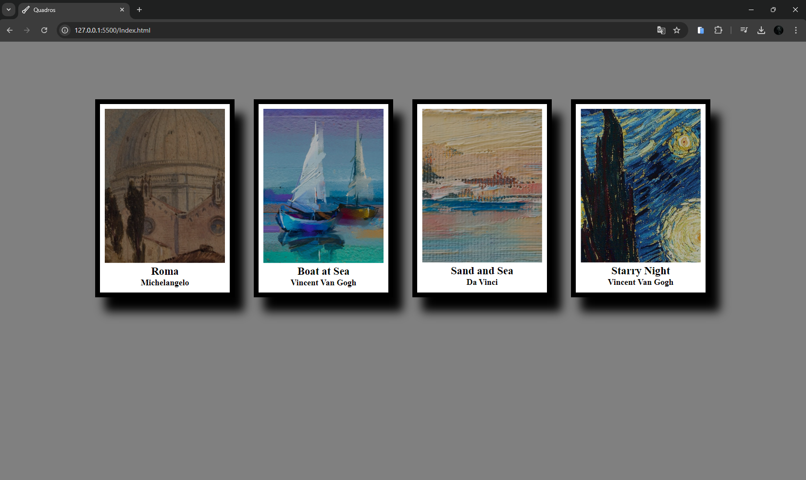

# Projeto Quadros
Esse projeto serve para poder testar meus conhecimentos em CSS trazendo pinturas famosas como se fosse uma exibição

## Tecnologias usadas:
- HTML
- CSS

## Tela do computador
[]

## Mobile
 []